<!-- Header Banner -->

<!-- Whale Animation -->

  

<!-- Social Badges -->

  
  
  

<!-- Typing Tagline -->

---

## 👤 About Me

  <em>Passionate developer who loves turning ideas into reality through code.</em>
   
  <strong>🚀 Always learning, always building, always innovating.</strong>
    
   I believe code is not just a tool, but an <strong>art form</strong> that shapes the digital world.

---

## 🛠️ Tech Stack

  

---

## 📦 Featured Projects

Click any card to explore the repository.

<table border="0" cellspacing="0" cellpadding="0">
  <tr>
    <td width="50%" valign="top" style="padding: 8px;">

[**🤖 AI-Learning-Journey**](https://github.com/LouisYeap/AI-Learning-Journey)
 *PyTorch · LangChain · NumPy · Pandas · Algorithms*
 记录 AI 核心技术学习之路，涵盖深度学习框架、LLM 应用开发、数据处理与算法训练。

    </td>
    <td width="50%" valign="top" style="padding: 8px;">

[**⛓️ simple_bitcoin_chain_python**](https://github.com/LouisYeap/simple_bitcoin_chain_python)
 *Python · Blockchain · Merkle Tree · Proof of Work*
 简化版比特币区块链 Python 实现，用于学习区块链核心概念：POW、默克尔树、动态难度调整。

    </td>
  </tr>
</table>

---

## 📊 GitHub Stats

  
  

---

## 🧑‍💻 Contribution Activity

  

---

## ⏱️ Productivity & Contribution Stats

  <table border="0" cellspacing="0" cellpadding="0">
    <tr>
      <td width="50%" align="center" style="padding: 4px;">
        
      </td>
      <td width="50%" align="center" style="padding: 4px;">
        
      </td>
    </tr>
  </table>

---

## 💻 Development Environment

  
  
  

---

## 🌟 Core Values

<table border="0" align="center" cellspacing="20" cellpadding="0">
  <tr>
    <td align="center" width="200">
      
       <strong>Innovation</strong>
       <small>Exploring new technologies</small>
    </td>
    <td align="center" width="200">
      
       <strong>Problem Solving</strong>
       <small>Breaking complex challenges</small>
    </td>
    <td align="center" width="200">
      
       <strong>Continuous Learning</strong>
       <small>Growing through curiosity</small>
    </td>
  </tr>
</table>

---

## 🤝 Let's Connect

  
  

---

  

  

    
      
    <em>"Code is poetry written in logic."</em>
  

